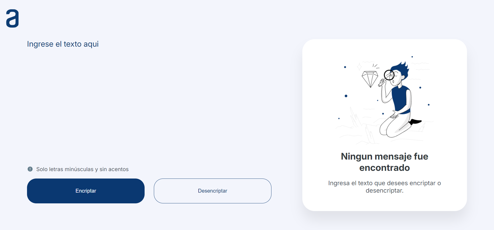
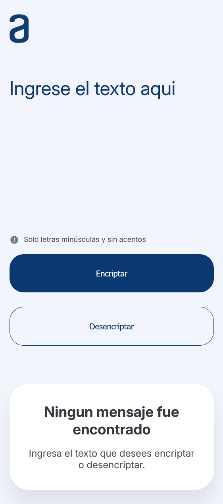
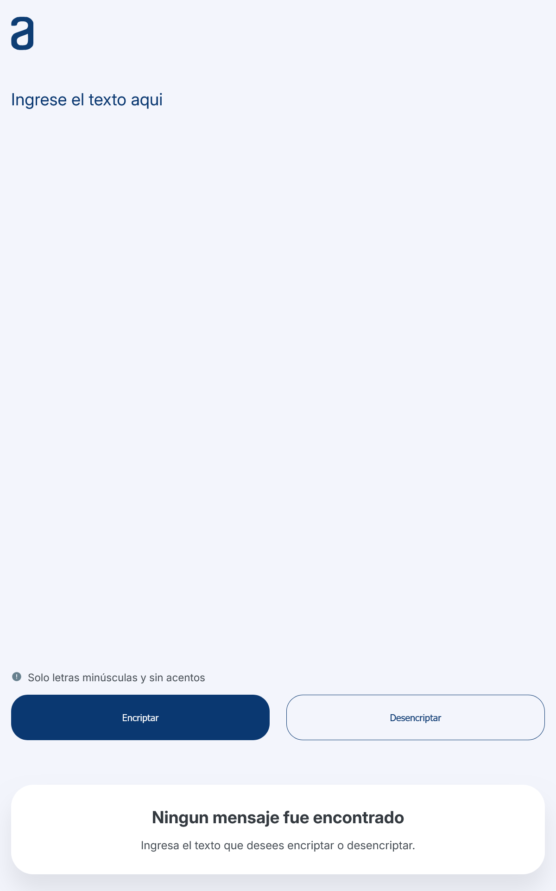

# Alura LATAM | Oracle ONE - Challenge Encriptador de Texto

El challenge consiste en utilizar HTML, CSS y JavaScript para el desarrollo de una pagina web que encripte y desencripte texto en base a claves de cifrado especificadas.

## Tabla de contenidos

- [El desafio](#el-desafio)
- [Screenshots](#screenshots)
- [Links](#links)
- [Desarrollado con](#desarrollado-con)

## El Desafio

Las "llaves" de encriptación que utilizaremos son las siguientes:

La letra "e" es convertida para "enter"
La letra "i" es convertida para "imes"
La letra "a" es convertida para "ai"
La letra "o" es convertida para "ober"
La letra "u" es convertida para "ufat"

### Requisitos:

- Debe funcionar solo con letras minúsculas.
- No deben ser utilizados letras con acentos ni caracteres especiales.
- Debe ser posible convertir una palabra para la versión encriptada también devolver una palabra encriptada para su versión original.

"gato" => "gaitober"
gaitober" => "gato"

La página debe tener campos para inserción del texto que será encriptado o desencriptado, y el usuario debe poder escoger entre as dos opciones.

El resultado debe ser mostrado en la pantalla.

### Extras:

Un botón que copie el texto encriptado/desencriptado para la sección de transferencia, o sea que tenga la misma funcionalidad del Ctrl+C o de la opción "copiar" del menú de las aplicaciones.

## Screenshots

### Desktop View

### Mobile View

### Tablet View

## Links

- Live Site URL: [Solution Hosted using Vercel]()

## Desarrollado con

- Semantic HTML5 markup
- CSS Custom Properties
- JavaScript
- DOM Manipulation
- Event Handling
- Mobile-first workflow
